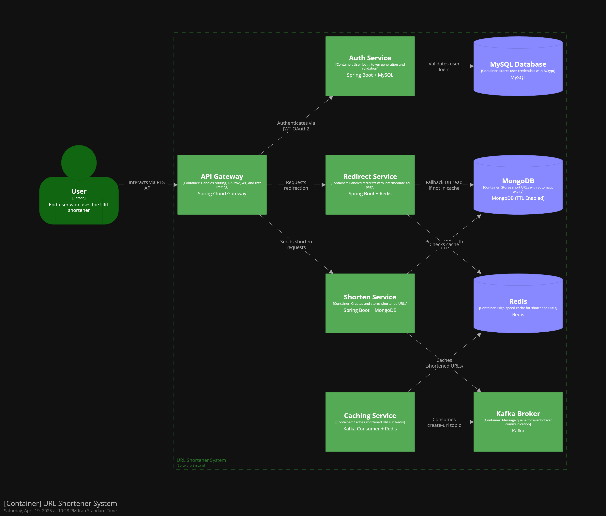
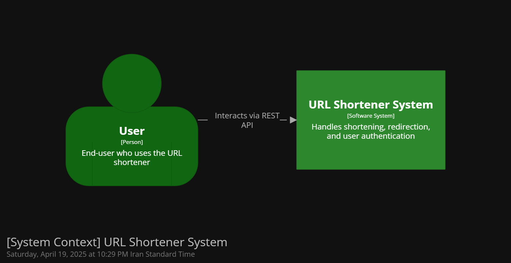
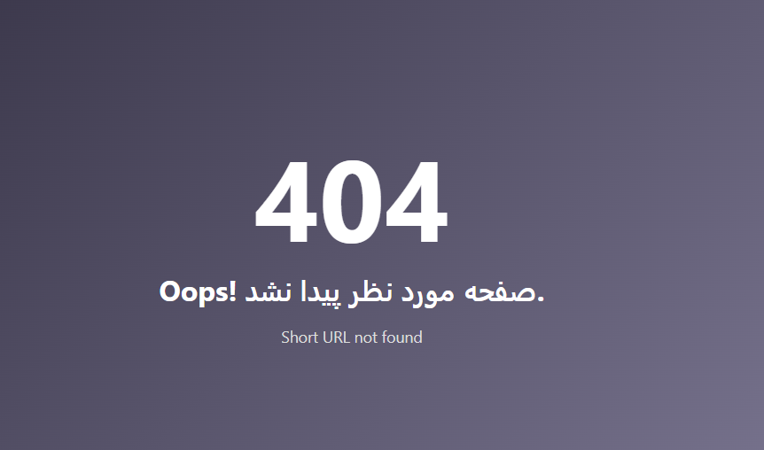

# 🔗 Scalable URL Shortener Microservice

A production-ready, distributed **URL shortener platform** built using **Spring Boot Microservices**, leveraging **OAuth2**, **Kafka**, **Redis**, **MongoDB TTL**, and **JWT Authentication**. This platform not only shortens links, but also supports **ad-based interstitial redirection**, **rate limiting**, and **high scalability** out of the box.

---

## 📌 Project Highlights

- ✅ Unique short URL generation
- 🔐 OAuth2 & JWT-based Authentication
- ⚡ Redis caching for high performance
- 🧪 Token-secured API Gateway with Rate Limiting
- 📩 Kafka-based Event-Driven architecture
- ⏳ MongoDB TTL auto-expiry for short URLs
- 🧠 Bcrypt password encryption with MySQL User Service
- 🎯 10-second Interstitial Ad Page before redirect
- 📈 Modular, Multi-Repo, Dockerized Microservices


---

## 🧱 System Architecture (C4 Architecture)






### 🌐 Flow Summary

1. **User Login** via `/auth/login` → receives JWT
2. **Create Short URL** via `/shorten` → saves in MongoDB, sends Kafka message
3. **Caching Service** listens to Kafka → caches URL in Redis with TTL
4. **Redirect Request** checks Redis → fallback to MongoDB → shows Ad page → redirects to original URL

---

## 🔧 Technologies Used

| Layer            | Technology                                       |
|------------------|--------------------------------------------------|
| Language         | Java 17                                          |
| Framework        | Spring Boot 3.2, Spring WebFlux, Spring Security |
| Messaging        | Apache Kafka                                     |
| Database         | MongoDB (TTL), MySQL                             |
| Caching          | Redis                                            |
| Auth             | OAuth2, JWT, Bcrypt                              |
| Gateway          | Spring Cloud Gateway                             |
| Monitoring       | Spring Actuator                                  |
| Frontend         | Thymeleaf, JavaScript                            |
| DevOps           | Docker, Docker Compose                           |
| Others           | Lombok, SLF4J, Maven, Rate Limiting              |

---

## 🚀 Getting Started

### 📥 Clone & Run (Dockerized)

```bash
git clone https://github.com/your-username/url-shortener.git
cd url-shortener
docker-compose up --build
```

### 🔐 Obtain JWT Token

```bash
curl --location 'http://localhost:8080/auth/login' --header 'Content-Type: application/json' --data '{
  "username": "testuser",
  "password": "123"
}'
```

### 🔗 Create Short URL

```bash
curl --location 'http://localhost:8080/shorten' --header 'Content-Type: application/json' --header 'Authorization: Bearer <your_jwt_token>' --data '{
  "longUrl": "https://google.com"
}'
```

### 🔁 Redirect Flow

```text
http://localhost:8080/r/abc123 → redirects to ad page for 10s → redirects to original link
```

---

## 📦 Data Persistence

| Storage  | Usage                            |
|----------|----------------------------------|
| **MongoDB** | Stores short URL mappings (TTL Index for expiry) |
| **Redis**   | Caches hot URLs for fast resolution               |
| **MySQL**   | Stores user credentials securely (hashed with Bcrypt) |

---

## 📣 Interstitial Redirect Page

- Users are shown an ad/interstitial page for **10 seconds** after accessing the short link
- Ads can be **static banners**, **dynamic content**, or **affiliate promotions**
- This feature is key to potential **monetization strategy**

---
## 📚 Photo of Redirect Page and 404 page




## 🧪 Testing

```bash
./mvnw test
```

All critical modules are covered with **unit tests**, including edge cases and failure scenarios.

---

## 🛡️ Security Considerations

- OAuth2 + JWT for authenticated APIs
- Rate Limiting at API Gateway (per IP / token)
- Sanitization of long URLs
- Password encryption using **Bcrypt**
- Secure Kafka communication (if TLS configured)

---

## 🔁 Kafka Events

| Topic         | Description                        |
|---------------|------------------------------------|
| `create-url`  | Emitted when a short URL is created |
| `url-visited` | [Future] For tracking analytics     |

---

## 📈 Monitoring & Health

- Exposed via `/actuator` endpoints
- Health, metrics, and readiness probes
- Can be integrated with **Prometheus**/**Grafana**

---

## 📄 API Reference

| Endpoint                | Method | Auth | Description                   |
|-------------------------|--------|------|-------------------------------|
| `/auth/login`           | POST   | ❌   | Login and get JWT             |
| `/shorten`              | POST   | ✅   | Create short URL              |
| `/r/{shortId}`          | GET    | ❌   | Redirect to original URL      |

---

## 📦 Versioning

We follow **Semantic Versioning**:

```
Current Version: 1.2.0
```

---

## 📍 Contact

Feel free to reach out:

- Email: [parsa10007@gmail.com](mailto:parsa10007@gmail.com)
- GitHub Issues for bugs & feature requests

---

**Made with ☕, Spring, and ❤️ by [Parsa Eftekharmanesh]**
